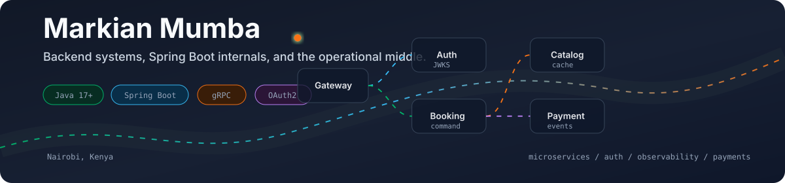
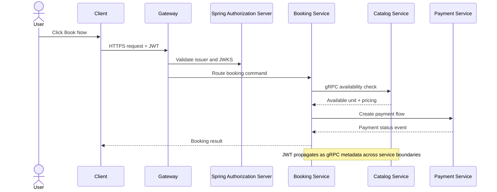

<p align="center">
  
</p>

<h1 align="center">Markian Mumba</h1>
<h3 align="center">Backend Engineer | Java / Spring Boot | Distributed Systems</h3>

<p align="center">
  <a href="https://medium.com/@mumbamarkian"></a>
  <a href="https://www.linkedin.com/in/markian-mumba-67231517a/"></a>
  <a href="mailto:mumbamarkian@gmail.com"></a>
</p>

<p align="center">
  Nairobi, Kenya
</p>

---

### About

I am a backend engineer working primarily in **Java / Spring Boot**, with a focus on microservices, distributed systems, and the operational realities around them: service discovery, auth flows, inter-service communication, observability, and the cross-cutting concerns nobody warns you about.

By day, I build production systems  across Spring Boot microservices, Angular frontends, and Azure infrastructure. By night I build deliberately over-engineered side projects to learn the parts production work does not always expose me to: gRPC, OAuth2 authorization servers, service meshes, and Spring auto-configuration internals.

I write about the build as I go.

---

### Writing: Over-Engineered on Purpose

A series documenting the build of **RentItUp**, a microservice platform, from scratch. Not a tutorial. More like an engineering journal of the decisions, dead ends, and small victories that happen when a simple product becomes a distributed system on purpose.

- **Part 8:** [A User Clicks 'Book Now' and Their JWT Travels Through Four Services. Here's How.](https://medium.com/@mumbamarkian/a-user-clicks-book-now-and-their-jwt-travels-through-four-services-here-s-how-f11af0832c6f) - gRPC interceptors, auto-configuration, and zero-trust between services
- **Part 7:** [Half of My OAuth2 Login Flow is Code I Never Wrote](https://medium.com/@mumbamarkian/half-of-my-oauth2-login-flow-is-code-i-never-wrote-c5eb810874cf) - Spring Authorization Server and JWKS

Full series on [Medium](https://medium.com/@mumbamarkian).

---

### RentItUp Request Path



The part I care about is not just whether a request succeeds. It is where trust is created, where it is carried, and where the system can fail without becoming mysterious.

```math
T_{booking} = T_{gateway} + T_{auth} + T_{booking-service} + T_{availability-grpc} + T_{payment} + \epsilon
```

That leftover `\epsilon` is where production usually hides: retries, network jitter, serialization, timeouts, logs, and the small decisions that decide whether debugging feels possible.

<!--
Direct GitHub video upload slot:
1. Record a short RentItUp walkthrough as .mp4, .mov, or .webm.
2. Open this README on GitHub and click Edit.
3. Drag the video into the editor.
4. GitHub will generate a user-attachments URL.
5. Paste that URL on its own line below this comment.
-->

---

### Stack

**Primary:** Java 17+, Spring Boot, Spring Security, Spring Cloud, gRPC, PostgreSQL, RabbitMQ, Docker, Gradle  
**Cloud / DevOps:** Azure App Service, Blob Storage, Front Door, GitLab CI/CD, Eureka, Zipkin, Flyway  
**Also work with:** Angular, Next.js, TypeScript, Go, Python / Django, MongoDB

---

### Selected Projects

#### [RentItUp](https://github.com/markmumba/rentitup-microservice)

*Spring Boot, gRPC, OAuth2, Eureka, PostgreSQL, RabbitMQ*

A machinery rental marketplace built as a deliberately over-engineered microservices platform. Four independently deployable services handle real-time availability, booking, and payment flows, with Spring Authorization Server and JWKS for auth, gRPC for inter-service communication, and a shared common module that standardizes auth, error handling, and service communication across the platform.

<details>
<summary><strong>Architecture notes</strong></summary>

- Custom Eureka name resolver and round-robin load balancing for gRPC clients.
- PostgreSQL unlogged-table caching layer for catalogue browsing.
- gRPC interceptors for propagating JWT context between internal services.
- Shared Spring Boot auto-configuration module for cross-cutting platform behavior.
- Documented through the **Over-Engineered on Purpose** writing series.

</details>

#### Foliocuts

*Spring Boot, PostgreSQL, M-Pesa Daraja*

A backend-driven barbershop management system digitizing payments, commissions, and operational reporting. It exposes REST APIs for transactions, staff commissions, customer loyalty, and role-based dashboards.

<details>
<summary><strong>Payment and operations details</strong></summary>

- Integrated M-Pesa STK Push for customer payments.
- Automated transaction recording, receipt generation, and reconciliation logic.
- Built around the messy realities of mobile-money callbacks, failed confirmations, retries, and staff commission tracking.

</details>

#### BolloApp

*Spring Boot, Docker, MTN MoMo, VPS Deployment*

Backend services for a smart waste management platform exposing real-time APIs for scheduling, billing, and collections. The services were containerized and shipped to a VPS through CI/CD pipelines.

<details>
<summary><strong>What this project taught me</strong></summary>

- Integrated MTN MoMo payments for automated billing and transaction verification.
- Learned how much of "production" is deployment, secrets management, release discipline, and not breaking working systems between releases.

</details>

#### [Smart Garbage Collection Platform](https://app.blazor-movies.online/)

*Spring Boot, Next.js, REST*

End-to-end platform connecting collection requests to provider routing.

---

### What I Am Into Right Now

- Kubernetes, so the next RentItUp iteration can move toward a real service mesh.
- Spring Boot internals: auto-configuration, bean post-processors, and the bits people treat as magic.
- Cleaner boundaries between auth, transport, observability, and business logic.

---

### Reach Out

Open to backend roles focused on Spring Boot, microservices, and distributed systems.

- Email: [mumbamarkian@gmail.com](mailto:mumbamarkian@gmail.com)
- LinkedIn: [markian-mumba-67231517a](https://www.linkedin.com/in/markian-mumba-67231517a/)
- Medium: [@mumbamarkian](https://medium.com/@mumbamarkian)
